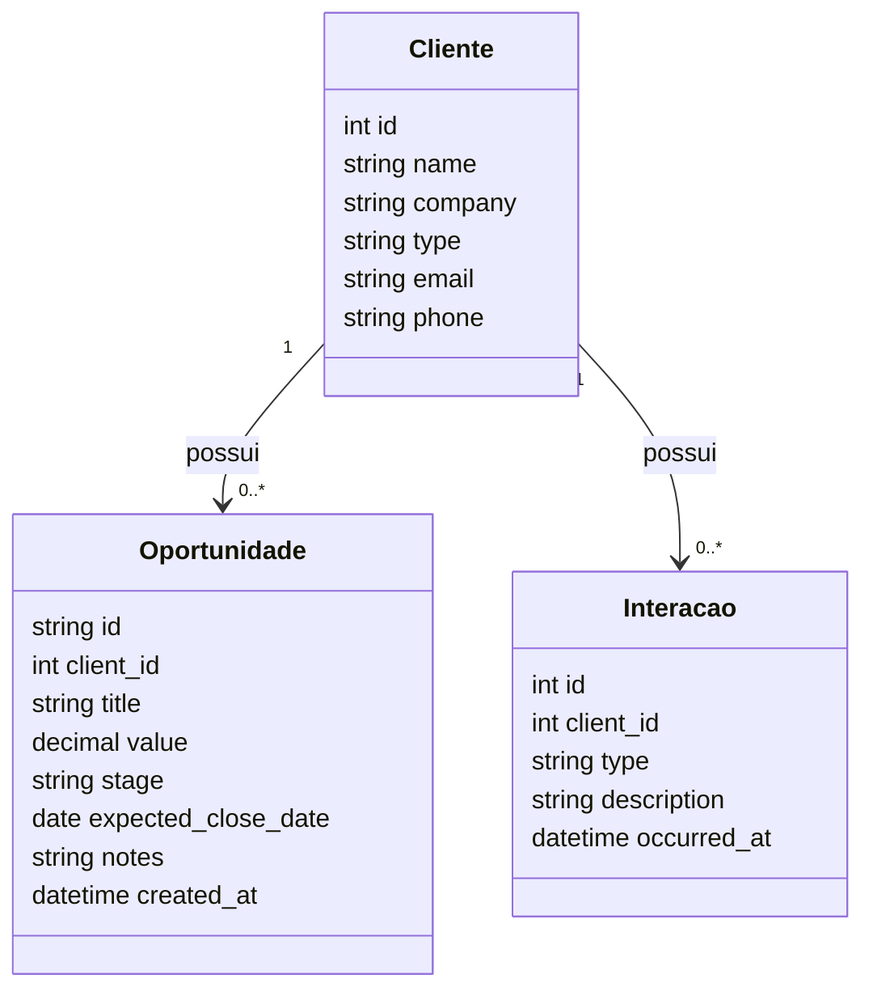
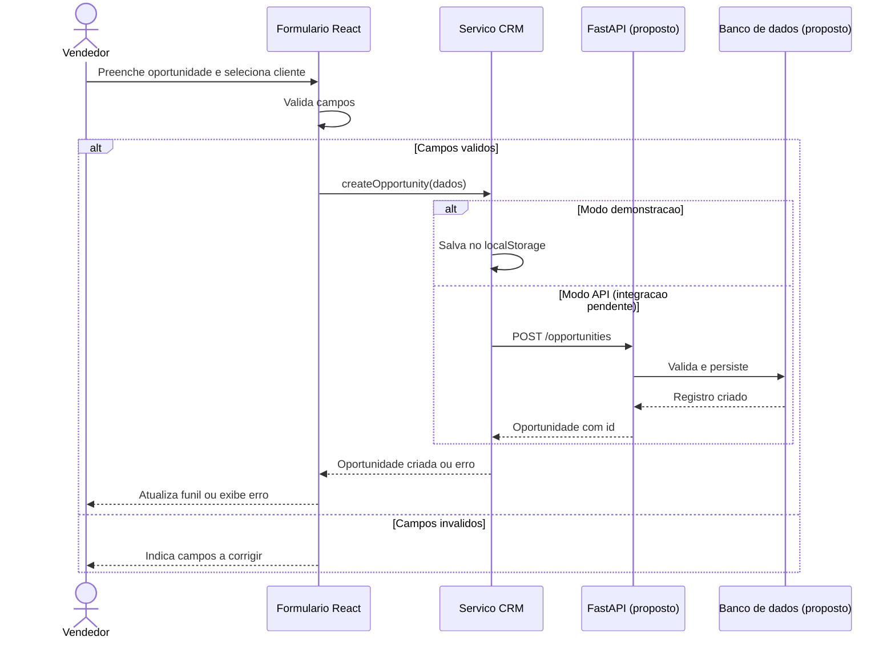

# NexoCRM - CRM para Pequenas Equipes Comerciais

## Integrantes e papéis

- **Ana Julia Pinheiro Macedo** — Backend
- **Alexandre da Cunha Cenachi** — Fullstack
- **Felipe Pires de Oliveira** — Frontend
- **Leonardo Murilho de Aquino Pereira** — Frontend

## Objetivo

O sistema tem como objetivo apoiar pequenas equipes comerciais no gerenciamento de clientes, leads e oportunidades de venda.
A aplicação permitirá centralizar informações de contato e acompanhar o histórico de interações.
Também será possível visualizar o andamento das negociações em um funil comercial.
Dessa forma, a equipe poderá organizar melhor seus contatos e acompanhar oportunidades abertas.
Além disso, poderá consultar rapidamente o histórico de relacionamento com cada cliente.

## Tecnologias

- **Frontend:** React
- **Backend:** FastAPI
- **Linguagens:** JavaScript e Python
- **Banco de dados:** SQLite
- **ORM:** SQLAlchemy
- **Versionamento:** Git e GitHub
- **Agente de IA:** OpenAI Codex

## Histórias de usuário

- **US01:** Como vendedor, quero cadastrar um cliente ou lead para armazenar suas informações de contato no sistema.
- **US02:** Como vendedor, quero visualizar e pesquisar clientes cadastrados para encontrar rapidamente suas informações.
- **US03:** Como vendedor, quero atualizar os dados de um cliente para manter suas informações corretas.
- **US04:** Como vendedor, quero registrar ligações, reuniões ou contatos realizados com um cliente para manter seu histórico de relacionamento.
- **US05:** Como vendedor, quero criar uma oportunidade de venda associada a um cliente para acompanhar uma possível negociação.
- **US06:** Como vendedor, quero alterar a etapa de uma oportunidade para representar o andamento da negociação.
- **US07:** Como vendedor, quero visualizar as oportunidades organizadas por etapa para acompanhar o pipeline comercial.
- **US08:** Como vendedor, quero acessar uma página com dados, interações e oportunidades de um cliente para ter uma visão consolidada do relacionamento.

## Frontend das US05–US08

Implementação inicial em `frontend/`, com React e Vite. Inclui criação de
oportunidades, mudança de etapa, funil comercial e visão consolidada do cliente.
Por padrão, utiliza dados fictícios e salva as oportunidades no navegador.
O backend real e a integração com as US01–US04 ainda estão pendentes.

```sh
cd frontend
pnpm install --no-frozen-lockfile
pnpm dev
```

O lockfile não é versionado; a instalação gera uma cópia local ignorada pelo Git.
As versões instaladas podem variar dentro das faixas declaradas no package.json.

Requer Node.js 22.12+ e pnpm 11. Guia de execução, contrato proposto da API,
critérios de aceitação e roteiro de revisão: [docs/FRONTEND.md](docs/FRONTEND.md).
Registro inicial do uso de IA: [docs/USO_IA.md](docs/USO_IA.md).

## Documentação UML preliminar

Os diagramas abaixo representam o modelo usado pelo frontend e o contrato
proposto. Precisam de revisão da equipe e alinhamento com o backend real.

### Diagrama de classes



### Diagrama de sequência: criação de oportunidade


