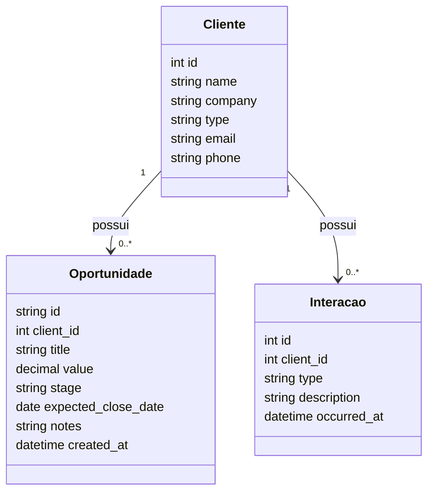
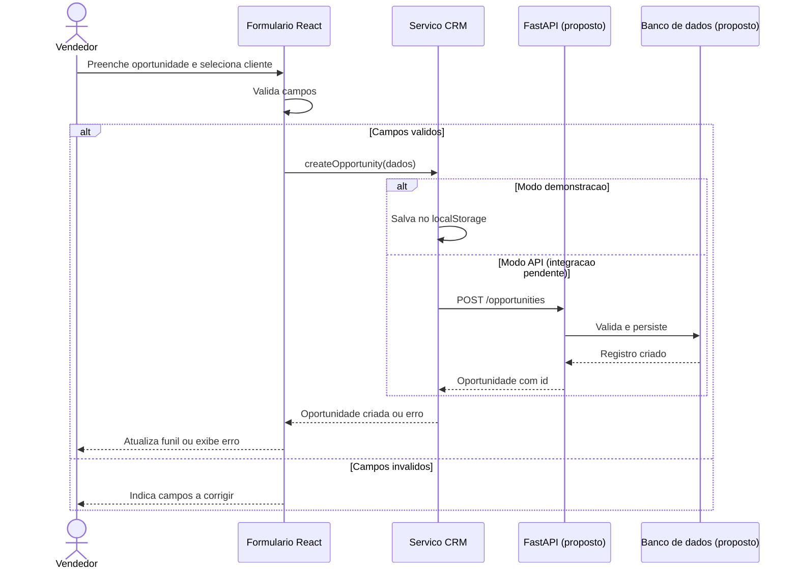

# NexoCRM - CRM para Pequenas Equipes Comerciais

## Integrantes e papéis

- **Ana Julia Pinheiro Macedo** — Backend
- **Alexandre da Cunha Cenachi** — Fullstack
- **Felipe Pires de Oliveira** — Frontend
- **Leonardo Murilho de Aquino Pereira** — Frontend

## Objetivo

O NexoCRM é um sistema desenvolvido para apoiar pequenas equipes comerciais no gerenciamento de clientes, leads e oportunidades de venda.

A aplicação permite centralizar informações de contato, registrar o histórico de interações com clientes, criar e acompanhar oportunidades comerciais e visualizar o andamento das negociações em um funil de vendas.

Além disso, o sistema disponibiliza uma visão consolidada de cada cliente, reunindo seus dados cadastrais, interações realizadas e oportunidades associadas.

## Funcionalidades

O sistema implementa as seguintes histórias de usuário:

- **US01:** cadastrar clientes e leads com suas informações de contato.
- **US02:** visualizar e pesquisar clientes cadastrados.
- **US03:** atualizar os dados de um cliente.
- **US04:** registrar ligações, reuniões e outros contatos realizados com um cliente.
- **US05:** criar uma oportunidade de venda associada a um cliente.
- **US06:** alterar a etapa de uma oportunidade.
- **US07:** visualizar oportunidades organizadas por etapa em um pipeline comercial.
- **US08:** acessar uma visão consolidada do cliente, incluindo dados, interações e oportunidades.

## Tecnologias

- **Frontend:** React + Vite
- **Backend:** FastAPI
- **Linguagens:** JavaScript e Python
- **Banco de dados:** SQLite
- **ORM:** SQLAlchemy
- **Validação de dados:** Pydantic
- **Versionamento:** Git e GitHub
- **Agente de IA:** OpenAI Codex

## Arquitetura

```text
React
  ↓
API REST
  ↓
FastAPI
  ↓
SQLAlchemy
  ↓
SQLite
```

## Documentação UML

Os diagramas abaixo representam o modelo usado pelo frontend e o contrato
proposto. Precisam de revisão da equipe e alinhamento com o backend real.

### Diagrama de classes



### Diagrama de sequência: criação de oportunidade


